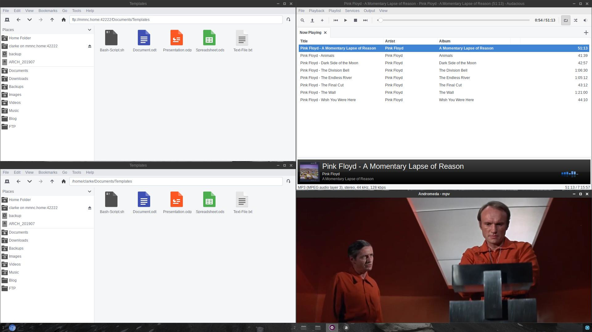
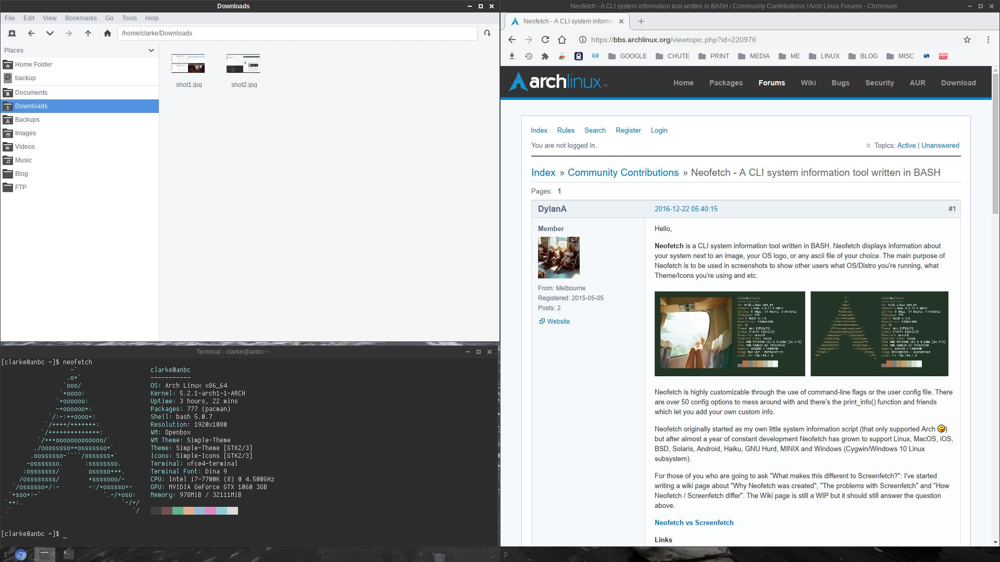

# Screenshots

```text
------------------------
```

<a href="/images/00/1.jpg"></a>

>

* file manager : pcmanfm :: Templates : attached media.
* audio player : audacious :: mp3 music.
* movie player : mpv :: mp4 movie.
* xorg panel : tint2 :: yad system tray notification for scrot screenshot

```text
------------------------
```

<a href="/images/00/2.jpg"></a>

>

* file manager : pcmanfm :: scrot screenshots.
* terminal : xfce4-terminal :: neofetch system information.
* web browser : ungoogled-chromium :: arch linux forum entry for neofetch.

>
